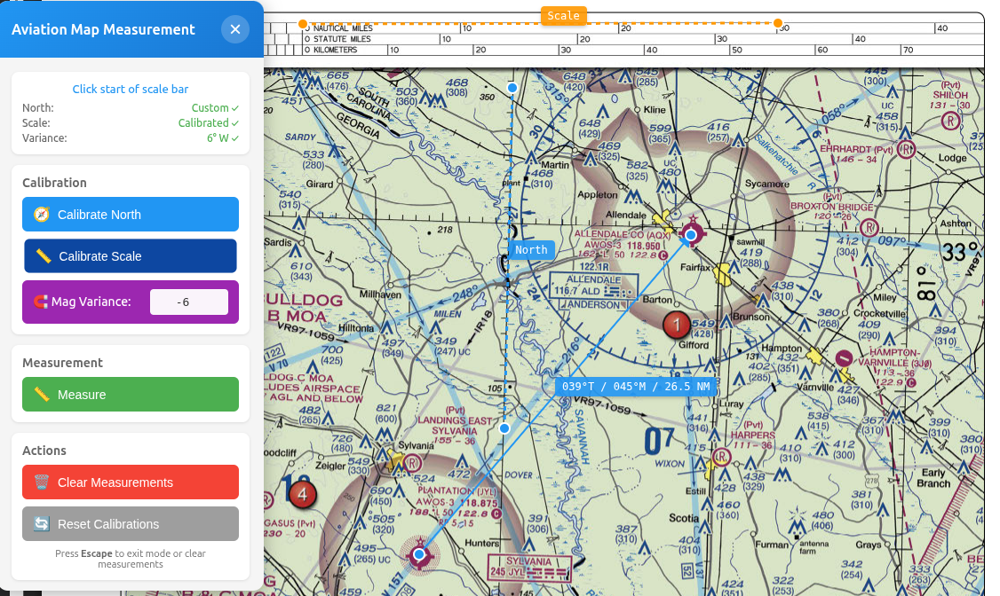

# Aviation Map Measurement Tool

A Chrome extension that adds measurement capabilities to maps, charts, and images viewed in the browser. Measure true and magnetic headings, distances in nautical miles, and calibrate to any map orientation.

Works with PDFs, image files, and web-based maps.



## Features

- **True & Magnetic Headings**: Displays both true and magnetic headings with magnetic variance
- **Instant Measurements**: Click two points to measure - shows true heading immediately
- **Combined Display**: Shows true heading, magnetic heading, and distance (e.g., "045°T / 039°M / 10.5 NM")
- **Magnetic Variance**: Set magnetic declination for automatic magnetic heading calculation
- **North Calibration**: Align measurements with compass rose (optional - defaults to up)
- **Scale Calibration**: Set distance scale for nautical mile measurements
- **Interactive Overlay**: Visual feedback with lines, arrows, and labels
- **Multiple Measurements**: Support for multiple simultaneous measurements
- **Draggable Control Panel**: Move the control panel anywhere on screen
- **Persistent Calibrations**: Calibrations stay set when clearing measurements

## Use Cases

- **Aviation Charts**: Measure headings and distances on sectional charts
- **Nautical Maps**: Plan routes and measure distances on marine charts
- **Topographic Maps**: Measure bearings and distances on hiking maps
- **Property Maps**: Measure dimensions on plot plans or survey maps
- **Game Maps**: Measure distances and angles on video game maps
- **Any Image with Scale**: Works on any image that has a reference scale

## Installation

### Loading the Extension in Chrome

1. Clone or download this repository
2. Open Chrome and navigate to `chrome://extensions/`
3. Enable **Developer mode** (toggle in top right corner)
4. Click **Load unpacked**
5. Select the `measurement-tool` directory from this repository
6. The Aviation Map Measurement Tool icon should appear in your Chrome toolbar

## Usage

### Basic Workflow

1. **Open any map, chart, or image** in Chrome (PDF, PNG, JPG, web page, etc.)
2. **Click the extension icon** in the toolbar - a floating control panel will appear
3. **Start measuring immediately**:
   - Click the "Measure" button
   - Click two points on your map
   - See the true heading between them (e.g., "045°T" for northeast)
   - By default, north is straight up (0°)
4. **Optional: Calibrate North** (if your map is rotated):
   - Click "Calibrate North" button
   - Click the center of the compass rose on your map
   - Click the north indicator on the compass rose
   - You'll see a blue dashed line showing your north reference
5. **Optional: Set Magnetic Variance** (for magnetic headings):
   - Enter the magnetic variance in the "Mag Variance" field in the Calibration section
   - Use positive numbers for East (e.g., `6` for 6°E)
   - Use negative numbers for West (e.g., `-10` for 10°W)
   - All measurements will now show both true and magnetic headings (e.g., "045°T / 039°M")
6. **Optional: Calibrate Scale** (to also measure distances):
   - Click "Calibrate Scale" button
   - Click the start of the scale bar on your map
   - Click the end of the scale bar
   - Enter the distance in nautical miles (e.g., "10")
   - Click "Submit"
7. **Measure with all features**:
   - After all calibrations, click "Measure" again
   - Click two points
   - See true heading, magnetic heading, and distance (e.g., "045°T / 039°M / 12.5 NM")

### Controls

- **Extension Icon**: Click to toggle the floating control panel on/off
- **Drag Panel**: Click and drag the panel header to move it anywhere on screen
- **Close Button (×)**: Close the control panel (top right of panel)
- **Escape Key**: First press exits current mode (allows page interaction), second press clears all measurements
- **Clear Measurements Button**: Removes all measurements (keeps calibrations)
- **Reset Calibrations Button**: Resets all calibrations (North, Scale, Variance) with confirmation
- **Delete Individual Measurements**: Click on any measurement label to delete it

### Status Indicators

The control panel shows:
- Current operation status
- North calibration status:
  - **Default (up)**: North is straight up (0°) - no calibration needed
  - **Custom ✓**: North has been calibrated to match your map's compass rose
- Scale calibration status (Not calibrated / Calibrated ✓)
- Magnetic variance status (Not set / 6° E ✓ / 10° W ✓)

## Repository Structure

```
aviation_map_tool/
├── README.md              # This file
├── LICENSE                # Apache 2.0 License
└── measurement-tool/      # Chrome extension (load this directory)
    ├── manifest.json      # Extension configuration
    ├── content.js         # Main coordination script
    ├── overlay.js         # Canvas overlay and drawing
    ├── control-panel.js   # Floating control panel UI
    ├── calculations.js    # Math utilities (including magnetic heading)
    ├── popup.html         # Extension popup UI
    ├── popup.js           # Popup event handlers
    ├── styles.css         # Styling for overlay and control panel
    └── icons/             # Extension icons
        ├── icon16.png
        ├── icon48.png
        └── icon128.png
```

## Technical Details

### Angle Calculation
- True headings are measured clockwise from north
- 0° = North, 90° = East, 180° = South, 270° = West
- North calibration accounts for map rotation

### Magnetic Variance
- Uses the aviation convention: Magnetic = True - Variance
- Positive values = East variance (magnetic heading < true heading)
- Negative values = West variance (magnetic heading > true heading)
- Example: True 045° with +6° variance → Magnetic 039°
- Example: True 045° with -6° variance → Magnetic 051°
- All existing measurements automatically update when variance changes

### Distance Calculation
- Uses pixel distance between points
- Converts to nautical miles using the calibrated scale ratio
- Accurate to within ±5% when properly calibrated

### Browser Compatibility
- Chrome (recommended)
- Chromium-based browsers (Edge, Brave, etc.)
- Works with:
  - Local PDF files (file:///)
  - Web-based PDFs
  - Image files (PNG, JPG, etc.)
  - Web pages with embedded maps or images

## Troubleshooting

### Extension icon not showing measurements
- Make sure you've opened a PDF file
- Click the extension icon to activate the overlay
- Check that "Toggle Overlay" hasn't hidden the measurements

### Measurements seem inaccurate
- Ensure north calibration was done correctly on the compass rose
- Verify scale calibration uses the entire scale bar
- Re-calibrate if the PDF zoom level changes significantly

### Extension not responding
- Refresh the page after loading/updating the extension
- Make sure you've clicked the extension icon to activate it
- Check the browser console for any error messages

## Tips

- **Floating Control Panel**: Drag the panel anywhere on screen for your preferred placement
- **Default North**: Start measuring angles immediately - north defaults to straight up
- **Escape Key**: First press exits mode (allows scrolling/zooming), second press clears measurements
- **Persistent Calibrations**: Calibrations (North, Scale, Variance) stay set when you clear measurements
- **Live Recalibration**: Changing north, scale, or variance automatically updates all existing measurements
- **Magnetic Variance**: Set variance once per map - it stays active for all measurements
- **North Calibration**: Only needed if your map is rotated or oriented differently
- **Zoom Level**: Calibrate at the zoom level you'll be using for measurements
- **Multiple Maps**: Each page maintains its own calibration data during the session
- **Precision**: For best accuracy, use the largest scale bar available on the map
- **Compass Rose**: Center your north calibration as precisely as possible
- **Page Interaction**: Press Escape to exit measurement mode and interact with PDFs (scroll, zoom, etc.)

## Development

To modify the extension:

1. Make changes to the source files
2. Go to `chrome://extensions/`
3. Click the refresh icon on the extension card
4. Reload any PDF pages where you want to test changes

## Version

Current version: 1.1.0

### Changelog

**v1.1.0** (Current)
- Added magnetic variance support with automatic magnetic heading calculation
- Updated display format: "045°T / 039°M / 10.5 NM" (true/magnetic/distance)
- Improved Escape key behavior: exits mode first, clears measurements second
- Calibrations now persist when clearing measurements
- Added Reset Calibrations button for starting fresh
- Reorganized control panel with calibrations grouped together
- Fixed CSS conflicts that affected host page layouts

**v1.0.0**
- Initial release with true heading and distance measurements
- North and scale calibration features
- Interactive overlay with draggable control panel

## License

This extension is provided as-is for aviation navigation planning and educational purposes.
